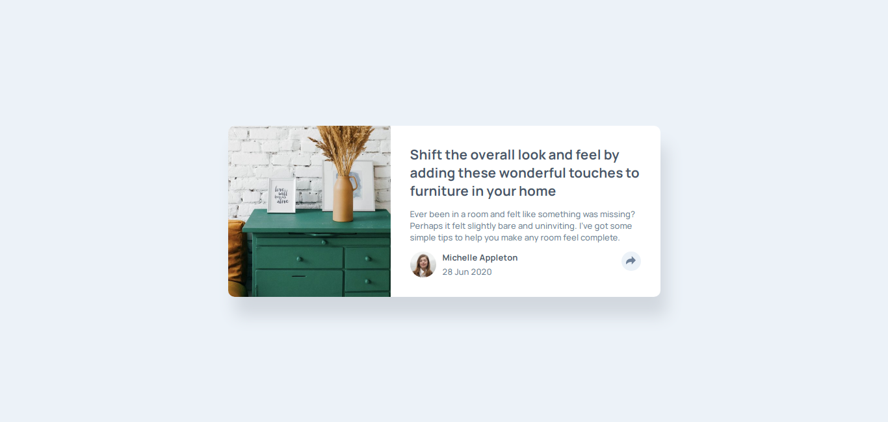
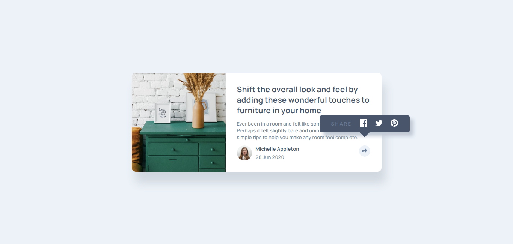
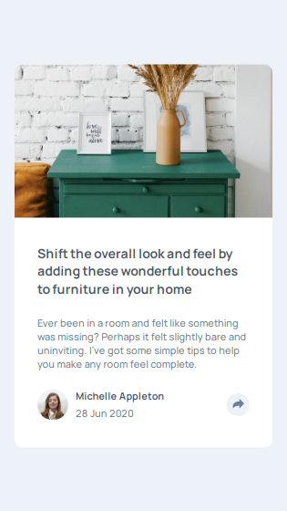
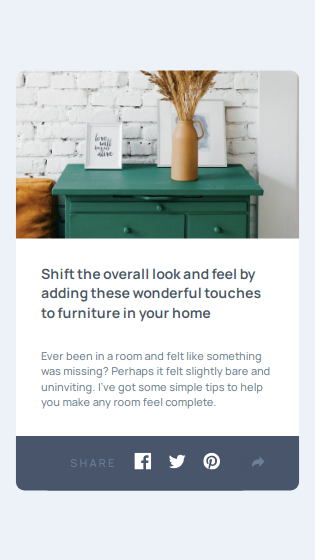

# Frontend Mentor - Article preview component solution

This is a solution to the [Article preview component challenge on Frontend Mentor](https://www.frontendmentor.io/challenges/article-preview-component-dYBN_pYFT). Frontend Mentor challenges help you improve your coding skills by building realistic projects. 

## Table of contents

- [Overview](#overview)
  - [The challenge](#the-challenge)
  - [Screenshot](#screenshot)
    - [Desktop version](#desktop)
    - [Mobile version](#mobile)
  - [Links](#links)
- [My process](#my-process)
  - [Built with](#built-with)
  - [What I learned](#what-i-learned)
  - [Continued development](#continued-development)
  - [Useful resources](#useful-resources)
- [Author](#author)


## Overview

### The challenge

Users should be able to:

- View the optimal layout for the component depending on their device's screen size
- See the social media share links when they click the share icon

# Screenshots
## Desktop

## Desktop - Active

## Mobile


## Mobile - Active



### Links

- Solution URL: [Github](https://github.com/m-nkosi/ARTICLE-PREVIEW-COMPONENT-MASTER)
- Live Site URL: [Live](https://clinquant-biscotti-419ab2.netlify.app)

## My process

### Built with

- Semantic HTML5 markup
- CSS custom properties
- Flexbox
- [JQuery](https://jquery.com/) - JS library

### What I learned


```css
.mainMobile > *:not(#lower) {
  padding:0 30px;
}
```
```js
  $('elemnt').is(':hidden)
```


### Continued development

#### In future projects i would like to learn the following:

1. more resposiveness on active modes
2. when active mode activates, make better translations


### Useful resources

- [w3schools](https://www.w3schools.com/) - this acted as my cheatsheet for applying flexbox
- [mdn](https://developer.mozilla.org/) - This is helped me edit style while learning onsite to my liking so that afterwards i could just just copy and paste the coding and i wouldnt have to rewrite the application (in this case the box shadow) 
- [stackoverflow](https://stackoverflow.com/) - this helped when i was looking for how to detect a non visible element using jquery

## Author

- Github - [Mxolisi Nkosi](https://github.com/m-nkosi)
- Frontend Mentor - [@m-nkosi](https://www.frontendmentor.io/profile/m-nkosi)


